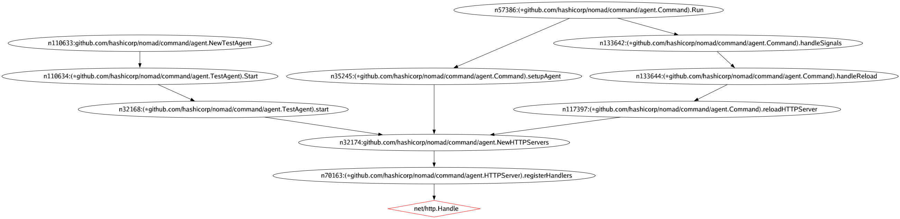

<div align="center">
	<h1><br />
		wally the cartographer
	</h1>
</div>

Wally is a static analysis tool for mapping function paths in code. It can be used for:

- HTTP and gRPC route detection
- Attack surface mapping.
- Automating the initial stages of threat modeling by mapping RPC and HTTP routes in Go code.
- Planning fuzzing efforts by examining the fault tolerance of call paths in code.

## UI Demo

https://github.com/hex0punk/wally/assets/1915998/1965f765-5437-4486-8c62-c125455b1f01

_Read about this graph and how to explore it in the [Exploring the graph with wally server](#Exploring-the-graph-with-wally-server) section_

## The basics

### Why is it called Wally?

Because [Wally](https://monkeyisland.fandom.com/wiki/Wally_B._Feed) is a cartographer, I like Monkey Island, and I wanted it to be called that :).

### Why not just grep instead?

So you are analyzing a Go-based application and you need to find all HTTP and RPC routes. You can run grep or ripgrep to find specific patterns that'd point you to routes in the code but:

1. You'd need to parse through a lot of unnecessary strings.
2. You may end up with functions that are similar to those you are targeting but have nothing to do with HTTP or RPC.
3. Grep won't solve constant values that indicate methods and route paths.

### What can Wally do that grep can't?

Wally currently supports the following features:

- Discover HTTP client calls and route listeners in your code by looking at each function name, signature, and package to make sure it finds the functions that you actually care about.
- Wally solves the value of compile-time constant values that may be used in the functions of interest. Wally does a pretty good job at finding constants and global variables and resolving their values for you so you don't have to chase those manually in code.
- Determine possible paths to a target function and examine the fault tolerance of such path. This is particularly useful when determining fuzzing targets or evaluating of panics discovered during fuzzing efforts.
- Wally will report the enclosing function where the function of interest is called.
- Wally will also give you all possible call paths to your functions of interest. This can be useful when analyzing monorepos where service A calls service B via a client function declared in service B's packages. This feature requires that the target code base is buildable.
- Wally will output a nice PNG graph of the call stacks for the different routes it finds.
- Determine which callpaths in code are tolerant to panics or application crashes due to bugs like nil dereferences

### Use cases - example

#### Mapping routes for security analysis

You are conducting an analysis of a monorepo containing multiple microservices. Often, these sorts of projects rely heavily on gRPC, which generates code for setting up gRPC routes via functions that call [`Invoke`](https://pkg.go.dev/google.golang.org/grpc#Invoke). Other services can then use these functions to call each other.

One of the built-in indicators in `wally` will allow it to find functions that call `Invoke` for gRPC routes, so you can get a nice list of all gRPC method calls for all your microservices. Further, with `--ssa` you can also map the chains of methods gRPC calls necessary to reach any given gRPC route. With `wally`, you can then answer:

- Can users reach service `Y` hosted internally via service `A` hosted externally?
- Which service would I have to initialize a call to send user input to service `X`?
- What functions are there between service `A` and service `Y` that might sanitize or modify the input set to service `A`?

#### Planning fuzzing efforts by examining call path tolerance

Say you are evaluating some microservices code in a monorepo and found several functions that seemed like good fuzzing targets due to their complexity and the type of data they handle. However, before fuzzing just for fuzzing’s sake, you want to answer the following:

- What are the different ways in which this function can be reached?
- For instance, can it only be reached via a gRPC or HTTP call that eventually lands at the target function, or is there some other process (say, a task run daily by a different process) that can call it with user input (e.g., pulled from a user database) via a different call path?
- If I find a panic here, how much would it matter? That is, would this be recovered by a function in the call path with a recover() in a defer block?

To learn how to answer the above questions, jump to the section on [using wally to detect fault tolerance of call paths](##Using-Wally-in-Fuzzing-Efforts-to-Determine-Fault-Tolerance-of-Call-Paths)

## Wally configurations

Wally needs a bit of hand-holding. Though it can also do a pretty good job at guessing paths, it helps a lot if you tell it the packages and functions to look for, along with the parameters that you are hoping to discover and map. So, to help Wally do the job, you can specify a configuration file in YAML that defines a set of indicators.

> [!TIP]
> If you are just interested in use cases of a single function, you can run Wally on [single function search mode](###Analyzing-individual-paths)

Wally runs a number of `indicators` which are basically clues as to whether a function in code may be related to a gRPC or HTTP route. By default, `wally` has a number of built-in `indicators` which check for common ways to set up and call HTTP and RPC methods using standard and popular libraries. However, sometimes a codebase may have custom methods for setting up HTTP routes or for calling HTTP and RPC services. For instance, when reviewing Nomad, you can give Wally the following configuration file with Nomad-specific indicators:

```yaml
indicators:
  - id: nomad-1
    package: "github.com/hashicorp/nomad/command/agent"
    type: ""
    function: "forward"
    indicatorType: 1
    receiverType: "ACL"    # optional 
    params:
      - name: "method"
  - id: nomad-2
    package: "github.com/hashicorp/nomad/nomad"
    type: ""
    function: "RPC"
    indicatorType: 1
    params:               # optional
      - name: "method"    # optional 
  - id: nomad-3
    package: "github.com/hashicorp/nomad/api"
    type: "s"
    function: "query"
    indicatorType: 1
    params:
        pos: 0           # optioncal
```

Note that you can specify the parameter that you want Wally to attempt to solve the value to. If you don't know the name of the parameter (per the function signature), you can give it the position in the signature. You can then use the `--config` or `-c` flag along with the path to the configuration file.

## Route Detection

A good test project to run it against is [nomad](https://github.com/hashicorp/nomad) because it has a lot of routes set up and called all over the place. I suggest the following:

1. Clone this project.
2. In a separate directory, clone [nomad](https://github.com/hashicorp/nomad).
3. Build this project by running `go build`.
4. Navigate to the root of the directory where you cloned nomad (`path/to/nomad`).
5. Create a configuration file named `.wally.yaml` with the content shown in the previous section of this README, and save it to the root of the nomad directory.
6. Run the following command from the nomad root:

```shell
$ <path/to/wally/wally> map -p ./... -vvv
```

## Running Wally with Docker

Wally can be easily run using Docker. Follow these steps:

1. Clone this project.
2. In a separate directory, clone [nomad](https://github.com/hashicorp/nomad).
3. Build the Docker Image:

    ```bash
    docker build -t go-wally .
    ```

4. Run an interactive shell inside the Docker container

    ```bash
    docker run -it go-wally /bin/sh
    ```

5. Run Wally with Docker, specifying the necessary parameters, such as the project path, configuration file, etc.:

    ```bash
    docker run -w /<PROJECT>/ -v $(pwd):/<PROJECT> go-wally map /<PROJECT>/... -vvv
    ```

   Adjust the flags (-p, -vvv, etc.) as needed for your use case.

6. If you have a specific configuration file (e.g., .wally.yaml), you can mount it into the container:

    ```bash
    docker run -w </PROJECT> -v $(pwd):</PROJECT> -v </PATH/TO/.wally.yaml>:</PROJECT>/.wally.yaml go-wally map -c .wally.yaml -p ./... --max-paths 50 -vvv
    ```

   This will run Wally within a Docker container, analyzing your Go code for HTTP and RPC routes based on the specified indicators and configurations.

7. Optionally, if you encountered any issues during the Docker build, you can revisit the interactive shell inside the container for further debugging.

8. After running Wally, you can check the results and the generated PNG or XDOT graph output, as explained in the README.


## Callpath analysis

Wally should work even if you are not able to build the project you want to run it against. However, if you can build the project without any issues, you can run Wally using the `--ssa` flag, at which point Wally will be able to do the following:

- Solve the enclosing function more effectively using [SSA](https://pkg.go.dev/golang.org/x/tools/go/ssa).
- Output all possible call paths to the functions where the routes are defined and/or called.

When using the `--ssa` flag you can expect output like this:

```shell
===========MATCH===============
ID:  14554c2a-41ee-4634-831d-6fc49c70c80d
Indicator ID:  1
Package:  github.com/hashicorp/cronexpr
Function:  Parse
Params:
Enclosed by:  (*github.com/hashicorp/nomad/nomad/structs.PeriodicConfig).Validate
Position /Users/hex0punk/Tests/nomad/nomad/structs/structs.go:5638
Possible Paths: 1
	Path 1 (filter limited):
		[Validate] nomad/structs/structs.go:5614:26 --->

===========MATCH===============
ID:  6a876579-6b72-4501-af5b-5028c84a1c77
Indicator ID:  1
Package:  github.com/hashicorp/cronexpr
Function:  Parse
Params:
Enclosed by:  (*github.com/hashicorp/nomad/nomad/structs.PeriodicConfig).Validate
Position /Users/hex0punk/Tests/nomad/nomad/structs/structs.go:5644
Possible Paths: 1
	Path 1 (filter limited):
		[Validate] nomad/structs/structs.go:5614:26 --->

===========MATCH===============
ID:  eeaa94b1-28a8-41b8-a1e3-7a0d665a1e4d
Indicator ID:  1
Package:  github.com/hashicorp/cronexpr
Function:  Parse
Params:
Enclosed by:  github.com/hashicorp/nomad/nomad/structs.CronParseNext
Position /Users/hex0punk/Tests/nomad/nomad/structs/structs.go:5677
Possible Paths: 28
	Path 1 (RECOVERABLE):
		nomad.[Plan] nomad/job_endpoint.go:1949:57 --->
		structs.[Next] nomad/structs/structs.go:5693:24 --->
		[CronParseNext] (recoverable) nomad/structs/structs.go:5670:6 --->
	Path 2 (RECOVERABLE):
		nomad.[Plan] nomad/job_endpoint.go:1949:57 --->
		structs.[Next] nomad/structs/structs.go:5699:27 --->
		[CronParseNext] (recoverable) nomad/structs/structs.go:5670:6 --->
	Path 3 (node limited) (RECOVERABLE):
		nomad.[leaderLoop] nomad/leader.go:247:34 --->
		nomad.[establishLeadership] nomad/leader.go:412:33 --->
		nomad.[SetEnabled] nomad/periodic.go:167:3 --->
		nomad.[run] nomad/periodic.go:332:14 --->
		nomad.[dispatch] nomad/periodic.go:342:38 --->
		structs.[Next] nomad/structs/structs.go:5693:24 --->
		[CronParseNext] (recoverable) nomad/structs/structs.go:5670:6 --->
```

### Filtering call path analysis

When running Wally in SSA mode against large codebases wally might run get lost in external libraries used by the target code. By default, Wally will filter call path functions to those belonging only to the module of each match discovered for a given indicator. This is what you'd want in most case. However, you can also filter analysis to only the packages container a string prefix which you can specify using `-f` followed by a string. For instance, when using wally to find HTTP and gRPC routes in nomad, you can to type the command below.

```shell
$ wally map -p ./... --ssa -vvv -f "github.com/hashicorp/" --max-paths 50
```

Additionally, there may be cases where a module cannot be found for a given function match e.g., in the case the function belongs to the standard library). By setting a filter using `-f <filter>` and keeping `module-only` set to `true`, wally will first default to filtering by the module strings and use the specified filter string whenever it cannot detect a module for a function match.

Where `-f` defines a filter for the call stack search function. 

#### Using an empty filter with `--module-only=false`

You can also allow wally to look beyond packages belonging to the target module by passing an empty filter and setting `module-only` to `false` (`-f "" --module-only=false`). However, keep in mind that doing so might result in wally getting stuck in some loop as it encounters recursive calls or very lengthy paths in scary dependency forests.

> [!IMPORTANT]
> You can also use `--max-paths` and an integer to limit the number of recursive calls Wally makes when mapping call paths (50 tends to be a good number). This will limit the paths you see in the output, but using a high enough number should still return helpful paths. Experiment with `--max-paths`, `--max-funcs`, `-f`, or all three to get the results you need or expect.

Wally has the following options to limit the search. These options can help refine the results, but can be used for various experimental uses of Wally as well.

- `--module-only`: Set to true by default. When set to true wally will restrict the call path search to the module of each function match.
- `-f`: filter string which tells wally the path prefix for packages that you are interested in. Typically, you'd want to enter the full path for the Go module you are targetting, unless you are interested in paths that may reach to standard Go functions (i.e. `runtime`) via closures, etc.
- `--max-paths`: maximum number of paths per match which wally will collect. This is helpful when the generate callgraphs report cyclic functions
- `--max-funcs`: maxium number of functions or nodes reported per paths. We recommed you use this if you run wally without a filter using `-f`
- `--skip-closures`: The default algorithm tries to be complete by returning possible ways in which closures can be used in the program, even if the path is not realistic given the program you are analyzing. This option reduces inaccurate paths by avoiding invalid paths from closures and instead skipping the enclosed function. _Note:_ This option is only supported by the BFS/default search algorithm.
- `--limiter-mode`: See explanation below

#### Limiter modes

At its core, Wally uses various algorithms available via the [golang.org/x/tools/go/callgraph](https://pkg.go.dev/golang.org/x/tools/go/callgraph) library. These algorithms can generate [spurious](https://pkg.go.dev/golang.org/x/tools/go/callgraph/cha) results at times which results in functions that go past main at the top of callpaths. To wrangle some of these sort of results, we perform a basic set of logical checks to eliminate or limit incorrect call path functions/nodes. By default, Wally uses the strictest limiter mode. Use the the other modes if you are not getting the results you expected. You can specify how the limiting is done using the `--limiter-mode` flag, followed by one of the modes levels below:

- `3` (strict): _This is the default mode_. Same as `skip-closures` plus all the restrictions above. In most cases, this mode and the `-f` filter is enough for getting the most accurate results. Typically, you won't _need_ to use `--max-paths` or `--max-funcs` when using this mode.
- `2` (high): Wally will stop once it sees a function node `A` in the `main` _package_ followed by a call to B in any other package other than the `main` package where A was found.
- `1` (normal): Wally will stop constructing call paths once it sees a call to either:
    - A function node A originating in the `main` _function_, followed by a call to node B not in the `main` function belonging to the same package
    - A function node A originating in the `main` _package_ followed by a call to node B inside the `main` function of a different package
    - A function node A originating in the `main` _pacckage_ followed by a function/node B not in the same package _unless_ function/node A is a closure.
- `0` (none): Wally will construct call paths even past main if reported by the chosen `tools/go/callgraph` algorithm.

### Analyzing individual paths

Rather than using a yaml configuration file, you can use `wally map search` for mapping paths to individual functions. For instance:

```bash
$ wally map search  -p ./... --func Parse --pkg github.com/hashicorp/cronexpr -f github.com/hashicorp/ -vvv
```
The options above map to the following

- `-p ./...`: Target code is in the current directory
- `--func Parse`: We are interested only in the `Parse` function
- `--pkg github.com/hashicorp/cronexpr`: Of package `github.com/hashicorp/cronexpr`
- `-vvv`: Very, very verbose
- `-f github.com/hashicorp/`: This tells Wally that we are only interested in paths within packages that start with `github.com/hashicorp/`. This avoids getting paths that reach beyond the scope we are interested in. Otherwise, we'd get nodes in standard Go libraries, etc. **Note:** this is optional, as by default wally will filter packages by the module string of each function match.

## Using Wally in Fuzzing Efforts to Determine Fault Tolerance of Call Paths

Wally can now tell you which paths to a target function will recover in case of a panic triggered by that target function. A detailed explanation can be found [here](https://hex0punk.com/posts/fault-tolerance-detection-with-wally/).

Using the [single function search mode](###Analyzing-individual-paths), we can determine which call paths to a given target function would recover in response to a panic

```shell
$ wally map search  -p ./... --func PrintOrPanic --pkg github.com/hex0punk/wally/sampleapp/printer -f github.com/hex0punk/wally/sampleapp -vvv

===========MATCH===============
ID:  f9241d61-d19e-4847-b458-4f53a86ed5c5
Indicator ID:  1
Package:  github.com/hex0punk/wally/samppleapp/printer
Function:  PrintOrPanic
Params:
Enclosed by:  github.com/hex0punk/wally/samppleapp.printCharSafe$1
Position /Users/alexuseche/Projects/wally/sampleapp/main.go:17
Possible Paths: 1
	Path 1 (RECOVERABLE):
		main.[main] main.go:11:15 --->
		main.[`printCharSafe`] main.go:16:16 --->
		safe.[RunSafely] (recoverable) safe/safe.go:12:4 --->
		main.[printCharSafe$1] main.go:16:17 --->

===========MATCH===============
ID:  eb72e837-31ba-4945-97b1-9432900ae3f9
Indicator ID:  1
Package:  github.com/hex0punk/wally/samppleapp/printer
Function:  PrintOrPanic
Params:
Enclosed by:  github.com/hex0punk/wally/samppleapp.printChar
Position /Users/alexuseche/Projects/wally/sampleapp/main.go:22
Possible Paths: 1
	Path 1:
		main.[main] main.go:12:11 --->
		main.[printChar] main.go:21:6 --->

Total Results:  2
```

Paths marked with `(RECOVERABLE)` will be fault tolerant. The function containing the `recover()` block is marked in the results as `(recoverable)`

## Visualizing paths with wally

To make visualization of callpaths easier, wally can lunch a server on localhost when via a couple methods:

After an analysis by passing the `--server` flag to the `map` command. For instance:

```shell
$ wally map -p ./... -c .wally.yaml --ssa -f "github.com/hashicorp/nomad" --server
```

Or, using the `server` subcommand and passing a wally json  file:

```shell
 $ wally server -p ./nomad-wally.json -P 1984
```

Next, open a browser and head to the address in the output.

## Exploring the graph with wally server

Graphs are generated using the [cosmograph](https://cosmograph.app/) library. Each node represents a function call in code. The colors are not random. Each color has a a different purpose to help you make good use of the graph.


<span style="vertical-align: top;">Finding node. This is a node discovered via wally indicators. Every finding node is the end of a path</span>


<span style="vertical-align: top;">This node is the root of a path to a finding node.</span>


<span style="vertical-align: top;">Intermediate node between a root and a finding node.</span>


<span style="vertical-align: top;">This node servers both as the root node to a path and an intermediary node for one or more paths</span>

### Viewing paths

Clicking on any node will highlight all possible paths to that node. Click anywhere other than a node to exist the path selection view.

### Viewing findings

Clicking on any finding node will populate the section on the left with information about the finding.

### Searching nodes

Start typing on the search bar on the left to find a node by name.

### PNG and XDOT Graph output

When using the `--ssa` flag, you can also use `-g` or `--graph` to indicate a path for a PNG or XDOT containing a Graphviz-based graph of the call stacks. For example, running:

```shell
$ wally map -p ./... --ssa -vvv -f "github.com/hashicorp/nomad/" -g ./mygraph.png
```

From _nomad/command/agent_ will output this graph:



Specifying a filename with a `.xdot` extension will create an [xdot](https://graphviz.org/docs/outputs/canon/#xdot) file instead.

## Advanced options

- You can specify which algorithm to use for the intial callgraph generation using `--callgraph-alg`. This is the algorithm used by the `golang.org/x/tools/` function. Options include `cha` (default), [`rta`](https://pkg.go.dev/golang.org/x/tools/go/callgraph/rta), and [`vta`](https://pkg.go.dev/golang.org/x/tools/go/callgraph/vta).
- By default, wally uses a breathd search first algorithm to map all paths. You can instead use depth first search using `--search-alg dfs`
- Whenever Wally sees it reaches a `main` function, it will stop going further back in the tree to avoid reporting inaccurate paths. If you wish, you can override this by using the `--continue-after-main` flag, allowing you to see some interesting but less likely paths.

## The power of Wally

At its core, Wally is, essentially, a function mapper. You can define functions in configuration files that have nothing to do with HTTP or RPC routes to obtain the same information that is described here.

## Logging

You can add logging statements as needed during development in any function with a `Navigator` receiver like this: `n.Logger.Debug("your message", "a key", "a value")`.

## Troubleshooting

At the moment, wally will often give you duplicate stack paths, where you'd notice a path of, say, A->B->C is repeated a couple of times or more. Based on my testing and debugging this is a drawback of the [`cha`](https://pkg.go.dev/golang.org/x/tools@v0.16.1/go/callgraph/cha) algorithm from Go's `callgraph` package, which wally uses for the call stack path functionality. I am experimenting with other available algorithms in `go/callgraph/` to determine what the best option to minimize such issues (while getting accurate call stacks) could be and will update wally's code accordingly. In the case that we stick to the `cha` algorithm, I will write code to filter duplicates.

### When running in SSA mode, I get findings with no enclosed functions reported

This is often caused by issues in the target code base. Make sure you are able to build the target codebase. You may want to run `go build` and fix any issues reported by the compiler. Then, run wally again against it.

### Wally appears to be stuck in loop

See the section on [Filtering call path analysis](#Filtering-call-path-analysis)

## Viewing help

Viewing the description of each command

### `map`

```Shell
$ wally map --help
```

#### `map search` (single function)

```Shell
$ wally map search --help
```

### `server`

```Shell
$ wally map --help
```

## Contributing

Feel free to open issues and send PRs. Please.
